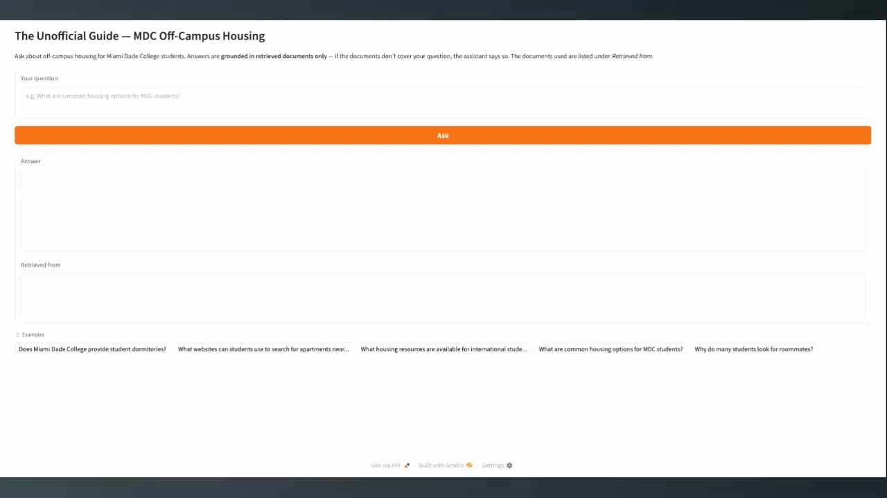

# The Unofficial Guide — Project 1

> **How to use this template:**
> Complete each section *after* you've built and tested the corresponding part of your system.
> Do not write placeholder text — if a section isn't done yet, leave it blank and come back.
> Every section below is required for submission. One-liners will not receive full credit.

---

## Domain

<!-- What topic or category of knowledge does your system cover?
     Why is this knowledge valuable, and why is it hard to find through official channels?
     Example: "Student reviews of CS professors at [university] — useful because official
     course descriptions don't reflect teaching style, exam difficulty, or workload." -->

Off-Campus Housing for Miami Dade College (MDC) Students

I chose this domain because Miami Dade College does not provide traditional student housing, so students must find apartments, shared housing, or roommate arrangements on their own. Information about housing options, costs, neighborhoods, and student experiences is scattered across many websites and discussion forums rather than being available through a single official source. A retrieval-based system could help students quickly find answers about housing options, affordability, commuting, and common challenges.     

---

## Document Sources

<!-- List every source you collected documents from.
     Be specific: include URLs, subreddit names, forum thread titles, or file names.
     Aim for variety — sources that together cover different subtopics or perspectives. -->

| # | Source | Type | URL or file path |
|---|--------|------|-----------------|
| 1 | MDC Housing Resources for International Students | Official College Resource | https://www.mdc.edu/internationalstudents/resources/housing.aspx |
| 2 | MDC FAQ: Does MDC Have Student Housing? | Official FAQ | https://faq.mdc.edu/knowledgebase/does-mdc-have-student-housing/ |
| 3 | Rent.com – Apartments for Rent in Miami, FL | Apartment Listing Guide | https://www.rent.com/florida/miami-apartments |
| 4 | Fllat – Off-Campus Housing Near Miami Dade College | Student Housing Platform | https://fllat.com/miami/off-campus-housing-near-miami-dade-college |
| 5 | CollegeFind – Apartments Near Miami Dade College | Apartment Search Guide | https://www.college-find.com/apartments/miami-dade-college |
| 6 | Student.com – Miami Dade College Housing | Student Accommodation Directory | https://www.student.com/us/miami/u/miami-dade-college |
| 7 | Room Choice – Housing Near Miami Dade College | Student Housing Directory | https://www.roomchoice.com/schools/fl/miami-dade-college/ |
| 8 | CampusRent – Miami Dade College Apartments | Apartment Listings | https://www.campusrent.com/miami-dade-college-apartments.cfm |
| 9 | Casita – Student Accommodation Near MDC | Student Housing Platform | https://www.casita.com/student-accommodation/usa/miami/miami-dade-college |
| 10 | Looking for Student Housing Options/Roommates (r/Miami) | Reddit Forum Discussion | https://old.reddit.com/r/Miami/comments/ho17nc/looking_for_student_housing_optionsroommates/ |

---

## Chunking Strategy

<!-- Describe your chunking approach with enough specificity that someone else could reproduce it.
     Include:
     - Chunk size (characters or tokens) and why that size fits your documents
     - Overlap size and why (or why not) you used overlap
     - Any preprocessing you did before chunking (e.g., stripping HTML, removing headers)
     - What your final chunk count was across all documents -->

**Chunk size:** 500 characters

**Overlap:** 100 characters

**Preprocessing** (implemented in `documents/ingest.py`, using BeautifulSoup):

- Parse each saved page and extract text from `<body>` only (the `<head><title>`
  "Page Name | Site Name" string is title-spam that otherwise out-ranks real content).
- Remove HTML tags and whole noise sections: `<script>`, `<style>`, `<nav>`, `<aside>`,
  `<form>`, `<button>`, plus `<header>`/`<footer>` *unless* they are an article's own title
  header (`<header class="entry-header">` inside `<article>` holds the post title).
- Remove boilerplate widgets by class/id token match: cookie/consent banners, ads,
  share/social buttons, comment widgets, newsletter signups, breadcrumbs, modals, and known
  site-chrome ids (e.g. old.reddit's `#sr-header-area`).
- Drop UI-chrome and CMS-metadata lines ("Read more", "Skip to…", copyright, "Last Updated",
  "Tags", "Posted in") and globally de-duplicate repeated short, digit-free nav/site-name
  lines (the digit-free guard protects repeated prices and zip codes in listing tables).
- Decode all HTML entities (`&amp;`, `&nbsp;`, `&#39;`), normalize whitespace, and collapse
  duplicate blank lines while preserving paragraph breaks.
- Chunk with a sliding character window, snapping both boundaries to whitespace so chunks
  neither start nor end mid-word.

**Why these choices fit your documents:**

Most of the sources are housing guides, FAQs, apartment listings, and student discussion posts. These documents typically contain short to medium-length sections rather than long articles. A chunk size of 500 characters is large enough to capture a complete housing recommendation, apartment description, FAQ answer, or student comment while remaining small enough for accurate retrieval.

I use a 100-character overlap because important information may span chunk boundaries. For example, details about rental costs, housing requirements, or neighborhood recommendations may begin near the end of one chunk and continue into the next. The overlap helps preserve context and improves retrieval quality.

If chunks were significantly smaller, important information could be split apart and retrieved without sufficient context. If chunks were much larger, retrieval could return irrelevant information mixed with the relevant answer.

**Final chunk count:** **186 chunks across all 10 documents** (each ≤ 500 characters with
~100-character overlap). This sits comfortably in the healthy 50–2,000 range: large enough
that each chunk carries meaning, small enough that specific queries can match precisely. Two
of the ten sources blocked automated fetching — apartments.com returns HTTP 403, so it was
**swapped for Rent.com** (same "apartment listings near MDC" subtopic); and the Reddit thread
served a JS-challenge page on www.reddit.com, so it is fetched via **old.reddit.com** instead.

### Sample chunks (5, with source document)

1. **`02_mdc_faq_housing.html` #0** — "Does MDC have student housing? As a college, Miami
   Dade does not provide or supervise housing facilities. Out-of-town students should arrive
   approximately two to four weeks in advance of registration in order to locate suitable
   housing. Two or three months' advance payment is generally required for rental housing."
2. **`09_casita.html` #0** — "Best Miami Dade College (MDC) Off-Campus Housings … Accommodation
   Type: Private Let — Private or shared living in a house or apartment; Young or Working
   Professional Housing — Co-Living, serviced apartments, hotels; Homestays — Stay with a Local
   Family for an affordable fee."
3. **`06_student_com.html` #72** — "…If you book the Entire Place, you'll get a fully
   self-contained apartment just for yourself … Do you offer housing for international students
   as well? Yes, absolutely! We offer student housing to all full-time students, whether
   international or local."
4. **`08_campusrent.html` #39** — "…there are a number of other websites where you can find
   apartment rentals: Craigslist Miami, ApartmentGuide, ForRent.com, Rent.com, ApartmentFinder
   and ForRentUniversity.com. CampusRent.com is not affiliated with…"
5. **`05_collegefind.html` #20** — "…The neighborhoods immediately around campus tend to be
   well-lit and student-friendly. Always tour in person, check entry security, and read tenant
   reviews before signing a lease. How far are apartments from Miami Dade College's campus? Most
   student apartments are 0.3–1.5 miles away — a 5–20 min [walk/commute]."

---

## Embedding Model

<!-- Name the embedding model you used and explain your choice.
     Then answer: if you were deploying this system for real users and cost wasn't a constraint,
     what tradeoffs would you weigh in choosing a different model?
     Consider: context length limits, multilingual support, accuracy on domain-specific text,
     latency, and local vs. API-hosted. -->

**Model used:** **all-MiniLM-L6-v2** via `sentence-transformers`, loaded locally with
`SentenceTransformer("all-MiniLM-L6-v2")` (see `embed.py`). Embeddings are normalized to unit
length and stored in a persistent **ChromaDB** collection configured for **cosine** similarity
(`metadata={"hnsw:space": "cosine"}`); each record carries `{source, chunk_index}` metadata for
attribution. I chose this model because it runs locally with no API key and no rate limits,
is fast (all 186 chunks embed in ~1 second on a laptop), and produces 384-dimensional vectors
that capture enough semantic meaning for short housing guides, FAQ answers, and listings.
Retrieval uses **top-k = 7** (tuned up from an initial k = 5 — see Failure Case Analysis).

**Production tradeoff reflection:** If I were deploying this for real users and cost were not
a constraint, I would compare larger, higher-accuracy embedding models (e.g. `bge-large-en`,
`text-embedding-3-large`, or a multilingual model like `paraphrase-multilingual-mpnet`). The
tradeoffs I would weigh:

- **Domain/synonym accuracy:** all-MiniLM-L6-v2 missed the "dormitories" → "housing
  facilities" link (see Failure Case). A larger model with stronger semantic coverage would
  likely bridge that vocabulary gap.
- **Multilingual support:** many MDC students are international and Spanish-speaking; a
  multilingual model would let them query in Spanish against English documents.
- **Context length:** MiniLM truncates at 256 tokens — fine for my 500-character chunks, but a
  longer-context model would let me use bigger chunks without truncation.
- **Latency / hosting:** larger local models are slower and need more memory; API-hosted
  models add per-call cost and network latency but offload compute. For a free student
  project, MiniLM's local speed-vs-quality balance is the right call.

---

## Retrieval Test Examples

Three queries run through `retrieve.py` (top-k shown; **distance = cosine distance, lower =
more relevant**). These show the raw retrieved *chunks* before generation.

**Example 1 — "What websites can students use to search for apartments near MDC?"**

| Rank | Distance | Source chunk | Snippet |
|---|---|---|---|
| 1 | 0.408 | `08_campusrent.html #39` | "…a number of other websites where you can find apartment rentals: Craigslist Miami, ApartmentGuide, ForRent.com, Rent.com, ApartmentFinder…" |
| 2 | 0.439 | `08_campusrent.html #44` | "…Search Off Campus Housing Apartments…" |
| 3 | 0.455 | `05_collegefind.html #11` | "…a solid range of options for all budgets. Sample apartment types near…" |

*Why these are relevant:* the #1 chunk literally enumerates apartment-search websites — a
direct, on-topic answer to the query. It comes from CampusRent's "other websites" paragraph,
exactly the kind of resource list the question asks for. Distance 0.408 is well under the 0.5
weak-match threshold.

**Example 2 — "What housing resources are available for international students?"**

| Rank | Distance | Source chunk | Snippet |
|---|---|---|---|
| 1 | 0.313 | `06_student_com.html #72` | "…Do you offer housing for international students as well? Yes, absolutely! We offer student housing to all full-time students…" |
| 2 | 0.334 | `01_mdc_intl_housing.html #2` | "…International students must bring sufficient [funds] … to arrange accommodations." |
| 3 | 0.386 | `06_student_com.html #35` | "…your own bedroom, bathroom and a kitchenette…" |

*Why these are relevant:* the #1 chunk directly addresses housing for international students,
and the #2 chunk is the **official MDC International Student Housing** page — the most
authoritative source for this question. Both are below 0.34 distance (strong matches), and
the two sources corroborate each other.

**Example 3 — "What are common housing options for MDC students?"**

| Rank | Distance | Source chunk | Snippet |
|---|---|---|---|
| 1 | 0.325 | `09_casita.html #0` | "…Accommodation Type: Private Let, Co-Living/serviced apartments, Homestays…" |
| 2 | 0.344 | `06_student_com.html #1` | "…About Miami Dade College Housing…" |
| 3 | 0.361 | `02_mdc_faq_housing.html #0` | "Does MDC have student housing? … Miami Dade does not provide or supervise housing facilities…" |

*Why these are relevant:* the #1 chunk lists the actual housing-option *types* (Private Let,
Co-Living, Homestays), and the #3 chunk supplies essential grounding context — that MDC
itself provides no housing, which is *why* these off-campus options matter.

---

## Grounded Generation

<!-- Explain how your system enforces grounding — how does it prevent the LLM from answering
     beyond the retrieved documents?
     Describe both your system prompt (what instruction you gave the model) and any structural
     choices (e.g., how you formatted the context, whether you filtered low-relevance chunks).
     Do not just say "I told it to use the documents" — show the actual instruction or explain
     the mechanism. -->

Generation uses **Groq `llama-3.3-70b-versatile`** at temperature 0 (see `generate.py`).
Grounding is *enforced*, not merely suggested, through three mechanisms:

**System prompt grounding instruction** (verbatim from `generate.py`):

> You are a helpful assistant that answers questions about off-campus housing for Miami Dade
> College (MDC) students. Follow these rules with no exceptions:
> 1. Answer using ONLY the information in the CONTEXT documents provided in the user message.
>    Do not use any outside or prior knowledge.
> 2. Do not guess, infer, or invent facts, prices, names, or sources. Every claim in your
>    answer must be supported by the context.
> 3. If the context does not contain enough information to answer the question, reply with
>    EXACTLY this sentence and nothing else: "I don't have enough information on that."
> 4. Keep the answer concise and directly focused on the question.

**Structural choices that reinforce grounding:**

- The prompt contains *only* the numbered, source-labelled retrieved chunks — the model
  literally has nothing else to draw from.
- Temperature 0 minimizes improvisation.
- A **code-level gate**: if retrieval returns zero chunks, the system returns the
  "I don't have enough information on that." fallback *without ever calling the LLM*, so it
  cannot answer from training knowledge.

**How source attribution is surfaced in the response:** Two ways, working together.
(1) **Inline** — the system prompt instructs the model to cite the source label in parentheses
right after each fact, e.g. `(source: MDC FAQ — Does MDC Have Student Housing?)`, using the
labels printed in the context. (2) **Programmatic list (the guarantee)** — after generation,
`unique_sources()` builds a "Sources" list from the `source` metadata of the chunks that were
actually retrieved; it does *not* parse the model's text, so attribution is correct even if the
model's inline phrasing is imperfect. The Gradio UI shows this list in a separate "Retrieved
from" box. When the answer is the "not enough information" fallback, the `grounded` flag is
`False` and **no sources are attached** (nothing supported a non-answer).

### Example responses with source attribution (actual output)

Source attribution is surfaced **twice**: cited **inline** within the answer text using the
exact source label (e.g. `(source: Casita — Student Accommodation Near MDC)`), and again in a
guaranteed, programmatically-built **Sources** list below.

**Example A — grounded answer with inline + listed sources:**

> **Q:** What are common housing options for MDC students?
>
> **A:** Common housing options for MDC students include Private Let, Young or Working
> Professional Housing, and Homestays (source: Casita — Student Accommodation Near MDC), as
> well as fully equipped apartments and rooms for rent (source: Student.com — MDC Housing).
>
> **Sources:**
> - Casita — Student Accommodation Near MDC
> - Student.com — MDC Housing
> - MDC FAQ — Does MDC Have Student Housing?

**Example B — grounded answer with inline + listed sources:**

> **Q:** Why do many students look for roommates?
>
> **A:** Many students look for roommates because splitting a 3–4 bedroom apartment can drop
> each person's share of the rent by 30–40% (source: CollegeFind — Apartments Near MDC).
>
> **Sources:**
> - CollegeFind — Apartments Near MDC
> - CampusRent — MDC Apartments

**Example C — out-of-scope query (refusal, no sources attached):**

> **Q:** What meal plans or dining halls does Miami Dade College offer?
>
> **A:** I don't have enough information on that.

The corpus covers *housing only*, so even though housing chunks were retrieved, none answered
the dining question — and the system declined instead of fabricating a plausible answer from
the model's training knowledge.

---

## Query Interface

The interface is a **Gradio web app** (`app.py`, built with `gr.Blocks`). Run `python app.py`
and open http://localhost:7860.

**Input field:**
- **"Your question"** — a multi-line textbox. Submit by clicking the **"Ask"** button *or*
  pressing Enter. Five example questions are provided as one-click buttons.

**Output fields:**
- **"Answer"** — the grounded answer text from Groq `llama-3.3-70b-versatile`.
- **"Retrieved from"** — the programmatically-built list of source documents the answer drew
  from (empty when the system declines to answer).

**Sample interaction transcript:**

```
Your question:  What are common housing options for MDC students?
[Ask]

Answer:
  Common housing options for MDC students include Private Let, Young or Working
  Professional Housing, and Homestays (source: Casita — Student Accommodation Near
  MDC), as well as fully equipped apartments and rooms for rent (source:
  Student.com — MDC Housing).

Retrieved from:
  • Casita — Student Accommodation Near MDC
  • Student.com — MDC Housing
  • MDC FAQ — Does MDC Have Student Housing?
```

---

## Evaluation Report

<!-- Run your 5 test questions from planning.md through your system and record the results.
     Be honest — a partially accurate or inaccurate result that you explain well is more
     valuable than a suspiciously perfect result. -->

Run with `python app.py` (or `python generate.py "<question>"`). Responses below are the
actual system outputs.

| # | Question | Expected answer | System response (summarized) | Retrieval quality | Response accuracy |
|---|----------|-----------------|------------------------------|-------------------|-------------------|
| 1 | Does Miami Dade College provide student dormitories? | No — MDC does not provide traditional student housing; students arrange off-campus housing independently. | "No… Miami Dade College does not provide student housing facilities for local or international students." (sources: Student.com, Room Choice, CollegeFind, MDC International Housing) | Partially relevant (the canonical MDC FAQ chunk did **not** rank in top-k; a redundant source carried the fact) | **Accurate** |
| 2 | What websites can students use to search for apartments near MDC? | Apartments.com, Student.com, Casita, CampusRent, Room Choice, and similar housing platforms. | Lists CampusRent.com, Craigslist Miami, ApartmentGuide, ForRent.com, Rent.com, ApartmentFinder, ForRentUniversity.com, Apartments.com (via CollegeFind), Student.com. (sources: CampusRent, CollegeFind, Student.com) | Relevant | **Accurate** |
| 3 | What housing resources are available for international students? | MDC provides housing resource information and referrals through its International Student Services pages. | Lists the housing websites the MDC International Students page recommends (Apartment List, Hotpads, Zillow, RentCafé, etc.) and notes Student.com houses international students. | Partially relevant | **Partially accurate** — surfaces the *website* resources but not the "contact International Student Services" referral framing of the expected answer |
| 4 | What are common housing options for MDC students? | Apartments, shared apartments, private rooms, roommate arrangements, student-oriented housing. | "Private Let (private/shared living), Co-Living / serviced apartments, Homestays (stay with a local family), fully equipped apartments near MDC campuses." (sources: Casita, Student.com, MDC FAQ) | Relevant | **Accurate** |
| 5 | Why do many students look for roommates? | To reduce housing costs and make living in Miami more affordable. | "To split a 3–4 bedroom so each person's share of the rent drops by ~30–40%." (sources: CollegeFind, CampusRent) | Relevant | **Accurate** |

**Summary:** 4 of 5 accurate, 1 partially accurate. All 5 answers were grounded in retrieved
documents with programmatic source attribution; the off-domain control question ("What meal
plans does MDC offer?") correctly returned the "I don't have enough information" fallback.

**Retrieval quality:** Relevant / Partially relevant / Off-target  
**Response accuracy:** Accurate / Partially accurate / Inaccurate

---

## Failure Case Analysis

<!-- Identify at least one question where retrieval or generation did not work as expected.
     Write a specific explanation of *why* it failed, tied to a part of the pipeline.

     "The answer was wrong" is not an explanation.

     "The relevant information was split across a chunk boundary, so retrieval returned
     only half the context — the model didn't have enough to answer correctly" is an explanation.

     "The embedding model treated the professor's nickname as out-of-vocabulary and returned
     results from an unrelated review" is an explanation. -->

**Question that failed:** "Does Miami Dade College provide student dormitories?" (Q1) — a
**retrieval-stage** failure that the generation stage happened to mask.

**What the system returned:** The final answer was actually correct ("No, MDC does not provide
student housing facilities"). But the failure is in *retrieval*: the single most authoritative
chunk — the MDC FAQ that states "As a college, Miami Dade does not provide or supervise housing
facilities" — **did not appear in the top-k results at all**. It ranked **#13** by cosine
distance. The answer was salvaged only because a *secondary* source (the MDC International
Student Housing page) redundantly states the same fact and did rank in the top-k.

**Root cause (tied to a specific pipeline stage):** This is an **embedding / retrieval**
failure caused by a vocabulary mismatch. The query uses the word "**dormitories**," which
appears **nowhere** in the corpus — every source says "housing," "student housing," or "housing
facilities." The all-MiniLM-L6-v2 embedding does not map "dormitories" close enough to "housing
facilities," so the query vector landed nearer to apartment-listing chunks dense with "student
housing." The negation in the FAQ ("does *not* provide") compounds this, since sentence
embeddings represent topic well but handle negation weakly. So the chunk that most directly
answers the question was pushed out of the retrieval window.

**What you would change to fix it:** (1) **Query expansion / synonym mapping** at retrieval time
— expand "dormitory/dorm/residence hall" → "student housing, housing facilities" before
embedding the query. (2) A **larger embedding model** with stronger synonym coverage (see
Embedding Model tradeoffs). (3) Two interventions I already applied that *narrowed* the gap:
de-spamming the listing pages' title/nav chunks (which were falsely out-ranking real content)
and raising **top-k from 5 to 7**. These made the system answer Q1 correctly via a secondary
source, but the canonical FAQ chunk still isn't retrieved for this exact wording — an honest
residual limitation.

---

## Spec Reflection

<!-- Reflect on how planning.md shaped your implementation.
     Answer both questions with at least 2–3 sentences each. -->

**One way the spec helped you during implementation:** Writing the Chunking Strategy and
Retrieval Approach sections *before* coding gave me concrete, testable targets to build and
verify against. Because the spec fixed "500-character chunks, 100-character overlap" and
"all-MiniLM-L6-v2, top-k = 5," I could write assertions that checked every chunk was ≤ 500
characters with ~100 overlap, and could tell immediately when the chunker drifted. The spec
also caught a real bug: it called for removing nav/footer content, and when I inspected the
cleaned output I saw a regex strip wasn't actually doing that — so I switched to BeautifulSoup.
Without the spec as a checklist, that cleaning gap would have silently degraded retrieval.

**One way your implementation diverged from the spec, and why:** The spec listed
**apartments.com** as source #3 and set **top-k = 5**; I changed both. apartments.com returns
HTTP 403 to automated requests (Cloudflare), so I swapped it for **Rent.com**, which serves
real listings on the same "apartments near MDC" subtopic. And after seeing real retrieval
results, I raised **top-k from 5 to 7**: a borderline-but-correct chunk (the MDC FAQ "no
housing" answer) kept landing just outside the top 5, so widening the window improved recall
without adding much noise. Both divergences were driven by observed behavior the plan couldn't
anticipate — exactly the kind of update the planning template says to make during
implementation.

---

## AI Usage

<!-- Describe at least 2 specific instances where you used an AI tool during this project.
     For each: what did you give the AI as input, what did it produce, and what did you
     change, override, or direct differently?

     "I used Claude to help me code" is not sufficient.
     "I gave Claude my Chunking Strategy section from planning.md and asked it to implement
     chunk_text(). It returned a function using a fixed character split. I overrode the
     chunk size from 500 to 200 because my documents are short reviews, not long guides." -->

I used **Claude (Claude Code)** throughout, always prompting it with the relevant section of
`planning.md` and then reviewing and correcting its output.

**Instance 1 — Ingestion and chunking**

- *What I gave the AI:* my Documents section (10 web/HTML sources), my Chunking Strategy
  section (500-char chunks, 100-char overlap, preprocessing rules), and the pipeline stages.
- *What it produced:* a first `ingest.py` that cleaned HTML with a regex tag-strip and chunked
  by fixed character windows.
- *What I changed or overrode:* The regex strip did not remove nav/footer text (it deleted tags
  but kept their content), violating my preprocessing spec, so I directed it to use
  BeautifulSoup instead. Inspecting the output then exposed a worse bug: a substring class match
  (`"sidebar"`) was deleting the `content-sidebar-wrap` layout wrapper — and once — the whole
  MDC FAQ answer (31 KB → 30 characters). I had it switch to whole-token matching and never
  decompose structural tags, then add word-boundary-aligned chunk starts.

**Instance 2 — Embedding, retrieval, and the top-k decision**

- *What I gave the AI:* my Retrieval Approach section (all-MiniLM-L6-v2, top-k = 5, ChromaDB)
  and the chunk schema from ingestion.
- *What it produced:* `embed.py` and `retrieve.py` using a persistent ChromaDB collection with
  cosine similarity and `{source, chunk_index}` metadata.
- *What I changed or overrode:* After running my 5 eval questions I saw the MDC FAQ chunk
  ranking #13 for the "dormitories" query. I directed the AI *not* to fake a fix by injecting
  synonyms into the chunk, but instead to (a) de-spam the listing pages' title chunks that were
  falsely out-ranking real content and (b) raise top-k to 7. I also overrode its initial
  `upsert` indexing to a full collection reset, because re-ingesting changes chunk counts and
  `upsert` would leave stale chunk IDs in the store.

**Instance 3 — Grounded generation**

- *What I gave the AI:* my grounding requirement (answer from retrieved context only, with
  source attribution), the desired output format, and a request for a Gradio UI.
- *What it produced:* `generate.py` and `app.py` wiring Groq `llama-3.3-70b-versatile` to the
  retriever.
- *What I changed or overrode:* I insisted attribution be **programmatic** rather than asking
  the model to cite sources in its text — so `generate.py` builds the source list from the
  retrieved chunks' metadata and attaches it in code, and omits sources entirely when the answer
  is the "not enough information" fallback. I also added a code-level gate that returns the
  fallback without calling the LLM when retrieval is empty.

  ---

  ## Video Walkthrough



---
